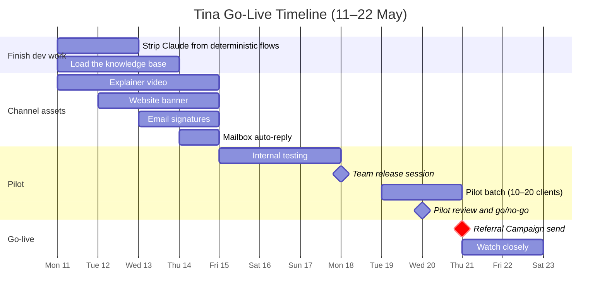
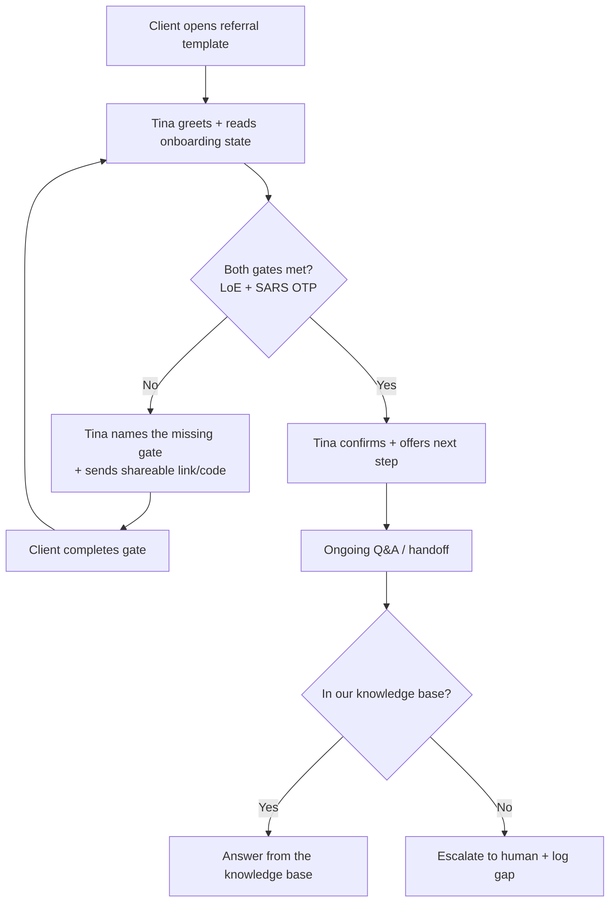
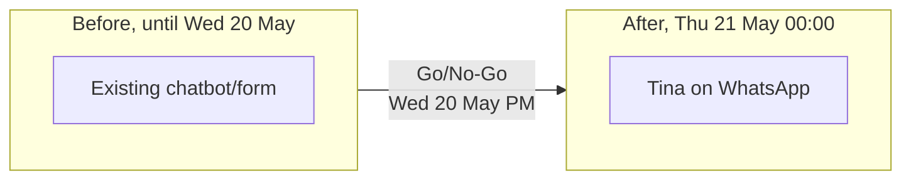
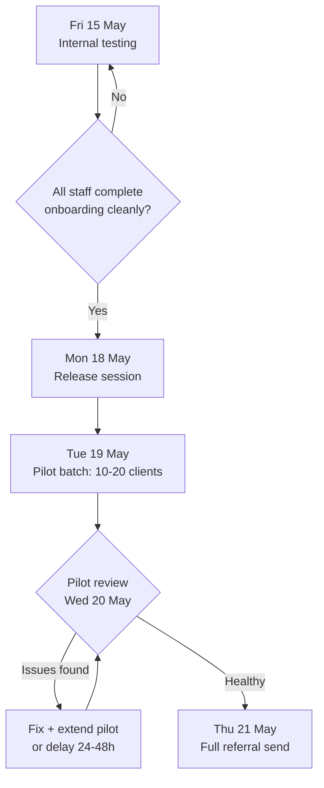

# Tina WhatsApp Bot: Go-Live Rollout Plan

**Owner:** Luc
**Anchor date:** Thursday **21 May 2026**. Referral Campaign send (= go-live)
**Drafted:** 11 May 2026

---

## TL;DR

We're switching off the existing chatbot/form and replacing it with **Tina**, our WhatsApp onboarding assistant. Go-live is locked to next week's Referral Campaign send (Thu 21 May). To de-risk that, we run a staged pilot (staff → small client batch → full send) and only open the gates once each stage looks healthy.



---

## 1. Milestones at a glance

| Date                 | Day   | Milestone                                                   | Owner           |
| -------------------- | ----- | ----------------------------------------------------------- | --------------- |
| **Mon 11 May** | Today | Plan signed off, dev work starts                            | Luc             |
| **Thu 14 May** |       | All channel assets locked (video, banner, sigs, auto-reply) | Marketing       |
| **Fri 15 May** |       | Internal testing opens                                      | Luc + TTT staff |
| **Mon 18 May** |       | **Team release session** (training)                         | Luc             |
| **Tue 19 May** |       | **Pilot batch send** to ~10–20 friendly clients             | Marketing       |
| **Wed 20 May** |       | **Pilot review** → Go / No-Go decision                      | Leadership      |
| **Thu 21 May** |       | **🚀 Referral Campaign send. GO LIVE**                      | Marketing       |
| **Fri 22 May** |       | Day 2 watching closely, retro scheduled                     | All             |

---

## 2. Channel activation plan

Four channels light up alongside the referral send. Each has a "ready by" date that feeds into the Thu 21 May go-live.

```
                                Go-Live (Thu 21 May)
                                        │
        ┌───────────────────┬───────────┼───────────────────┬───────────────────┐
        ▼                   ▼           ▼                   ▼                   ▼
 Referral Campaign    Website banner   Email signatures   Mailbox auto-reply   Explainer video
   (WhatsApp template)  (homepage CTA)  (all staff)        (tina-bot@…)        (social + site)
   Ready: Thu 21 May    Ready: Thu 14   Ready: Thu 14      Ready: Thu 14       Ready: Thu 14
```

| Channel                               | Purpose                                              | Ready by   | Owner     |
| ------------------------------------- | ---------------------------------------------------- | ---------- | --------- |
| Marketing explainer video             | "Meet Tina", sets expectations before clients chat  | Thu 14 May | Marketing |
| Website banner / landing page         | Homepage CTA → WhatsApp deep link                   | Thu 14 May | Marketing |
| Email signatures                      | Every outbound email surfaces Tina                   | Thu 14 May | Ops       |
| Tina mailbox auto-reply               | `tina-bot@ttt-group.co.za` redirects to WhatsApp   | Thu 14 May | Luc       |
| Referral Campaign (WhatsApp template) | Primary go-live moment                               | Thu 21 May | Marketing |

**Rule:** No channel goes live before internal testing starts (Fri 15 May). Nothing publicly points at Tina until we've used her ourselves.

---

## 3. Conversation flow: keeping Tina alive

The biggest soft risk: a client opens the WhatsApp template, replies once, and Tina drops the thread. We need each turn to either **answer**, **progress onboarding**, or **hand off**. Never dead air.



**Confirm before go-live:**

- Every inbound re-reads both onboarding gates fresh (no cached state)
- "Dead-end" replies (silence, emoji, "ok") still get a nudge from Tina
- Handoff path to a human is one tap and clearly labelled

---

## 4. Knowledge & cost discipline

Two principles we've decided to enforce before going live:

### 4a. Tina uses **proprietary knowledge**, not just Claude's general training

|      | Source                                 | When used                                                 |
| ---- | -------------------------------------- | --------------------------------------------------------- |
| ✅   | TTT knowledge base (SharePoint-synced) | Tax process, fees, document requirements, "how TTT works" |
| ✅   | Dynamics 365 (live client record)      | Anything about *this* client's status                     |
| ⚠️ | Claude general knowledge               | Last resort, with a "I'll confirm with the team" hedge    |

**Ready check (Thu 14 May):** Top 20 client questions all answer from the knowledge base, not Claude alone.

### 4b. Deterministic flows where deterministic is correct

> Using an LLM agent for a flow that has one right answer is a lazy way to burn money and add latency.

| Flow                           | Deterministic?              | Why                   |
| ------------------------------ | --------------------------- | --------------------- |
| "Send me the LoE link"         | ✅ Deterministic            | Same link every time  |
| "What's the SARS OTP link"     | ✅ Deterministic            | Same link every time  |
| "Have I completed onboarding?" | ✅ Deterministic            | Direct Dynamics read  |
| Open-ended tax question        | 🤖 LLM with knowledge base  | Real reasoning needed |
| Handoff request                | ✅ Deterministic            | Route + notify        |

**Ready check (Wed 13 May):** Audit every flow. Anything answerable from Dynamics or a static link must not pass through Claude.

---

## 5. Have we handled for scale?

Referral Campaign could light up Tina with hundreds of inbound messages in the same hour. We're not running a separate load test. The pilot batch on Tue 19 May is our scale check. If it holds, we're confident for Thursday. If it doesn't, we fix or delay.

Things we're watching during the pilot:

```
   ┌──────────────────────────────────────────────────────────────┐
   │  What we watch                     What good looks like      │
   ├──────────────────────────────────────────────────────────────┤
   │  Concurrent conversations          Holding up, no queueing   │
   │  Meta rate limits                  No throttling             │
   │  Claude / Mistral quotas           No errors, alerts armed   │
   │  Supabase write throughput         No timeouts               │
   │  Cost per conversation             In budget, alarmed        │
   └──────────────────────────────────────────────────────────────┘
```

---

## 6. Testing timeline

```
Week of 11 May            Week of 18 May
M  T  W  T  F  S  S       M  T  W  T  F
│  │  │  │  │           │  │  │  │  │
│  │  │  │  └─ Internal testing opens
│  │  │  └─ Channel assets locked
│  │  └─ Knowledge base loaded
│  └─ Deterministic flows stripped
└─ Dev work starts
                          │  │  │  │  └─ Watching closely
                          │  │  │  └─ 🚀 GO LIVE
                          │  │  └─ Pilot review
                          │  └─ Pilot batch send
                          └─ Team release session
```

| Stage             | Window              | Pass criteria                                                     |
| ----------------- | ------------------- | ----------------------------------------------------------------- |
| Flow audit        | Mon 11 – Tue 12 May | Every deterministic flow bypasses Claude                          |
| Knowledge base    | Mon 11 – Wed 13 May | Top 20 questions answer from the knowledge base                   |
| Internal testing  | Fri 15 – Sun 17 May | Every staff member completes onboarding as a "test client"        |
| Pilot batch       | Tue 19 – Wed 20 May | 10–20 real clients, no conversation drops, no escalation backlog  |

---

## 7. Team release session: Mon 18 May

A single hour with the team before the pilot sends. Goal: everyone knows what Tina does, what she doesn't, and how to take a handoff.

**Agenda:**

1. What Tina is (and isn't)
2. Live demo: happy path
3. Live demo: handoff path
4. Where to look when something feels off
5. How to flag a gap in the knowledge base
6. Q&A

**Recording:** Yes, for anyone who can't attend live and for new hires.

---

## 8. Switch-over plan

We're replacing the **existing chatbot/form**. The switch is binary on Thu 21 May.



**Switch-off checklist (Wed 20 May evening):**

- [ ] Old chatbot/form CTAs removed from website
- [ ] Old form redirects to WhatsApp deep link
- [ ] Old form inbox monitored for 7 days (catch stragglers)
- [ ] Comms ready in case we have to roll back

**Rollback plan:** If pilot review (Wed 20 May) flags a blocker, we delay the referral send by 24–48h and re-pilot. The old chatbot stays warm until Fri 22 May as a safety net.

---

## 9. Pilot strategy: the most important week



**Pilot batch selection (~10–20 clients):**

- Existing engaged clients we trust to give honest feedback
- Mix of tax-status states (some pre-LoE, some post-LoE, some fully onboarded)
- All flagged in Dynamics so we can track their journey end-to-end

**What we measure during pilot:**

- Response latency (every turn)
- Drop-off points (where conversations die)
- Escalations to humans (volume + reason)
- Cost per conversation
- Client sentiment (one-question feedback at the end)

---

## 10. Watching closely: Thu 21 May to Fri 22 May

Two people on call, watching live:

- Conversation logs
- Error rates / failed sends
- Cost dashboard
- Mailbox + email overflow

Retro booked for **Mon 25 May**.

---

## 11. Open questions / risks

| Risk                                             | Mitigation                                              |
| ------------------------------------------------ | ------------------------------------------------------- |
| Meta template approval delays the campaign       | Submit template by Wed 13 May; have fallback copy ready |
| Knowledge base has gaps for common questions     | Pilot batch surfaces gaps; rapid patch before Thu       |
| Cost spikes from non-deterministic flows         | Flow audit Mon–Tue; alarms on per-conversation cost    |
| Staff don't know how to take a handoff           | Release session Mon 18 May; recorded                    |
| Old chatbot still receiving traffic after switch | Redirect, not delete; monitor inbox 7 days              |

---

## 12. Decision log

| Date   | Decision                                                                                                 |
| ------ | -------------------------------------------------------------------------------------------------------- |
| 11 May | Go-live anchored to Thu 21 May Referral Campaign                                                         |
| 11 May | Pilot = small client batch (~10–20), not staff-only                                                     |
| 11 May | All four launch channels (video, banner, sigs, mailbox) activate Thu 14 May, public-facing on Thu 21 May |
| 11 May | Existing chatbot/form switched off Thu 21 May; kept warm as rollback until Fri 22 May                    |
